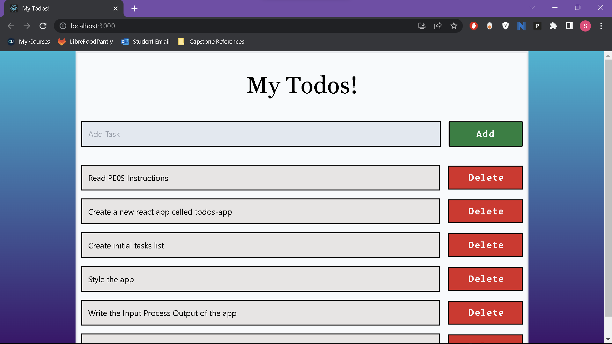

# INPUT
This app contains a list of three hardcoded intial tasks.

The user may type into the input box.  
The user may click on Add or Delete buttons.

# PROCESS
Upon startup, the App component reads the initial tasks to set the default state of the tasks array. When the user types, the state of the AddTask component tracks the input. When the user presses the 'Add' button, whatever is in (or not in) the input box will be added to the end of the tasks array, updating the state of the App component. When the user presses the 'Delete' button, the tasks state in the App component will update to exclude the task whose id was selected.

# OUTPUT
This app has a gradient background the adjusts with the length of the list. The title of the App is My Todos! which displays both as a page header and on the browser tab as the title. Below the page header, there is an input box with 'Add Task' as the placeholder, with a button to its right that reads 'Add'. Below the input box, there is the list of tasks, with new tasks being added to the bottom of the list. Each task in the todo list also has a 'Delete' button to the right of the text. All buttons darken when the user hovers over them. 

